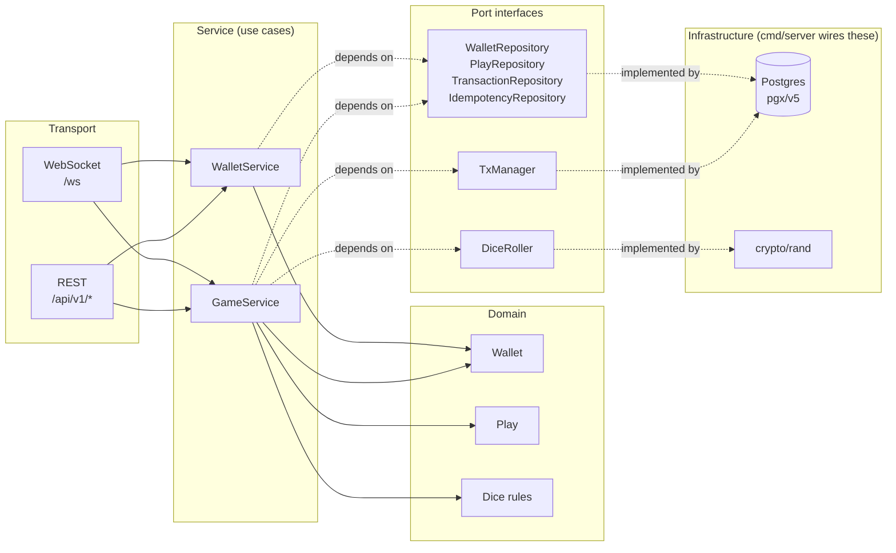
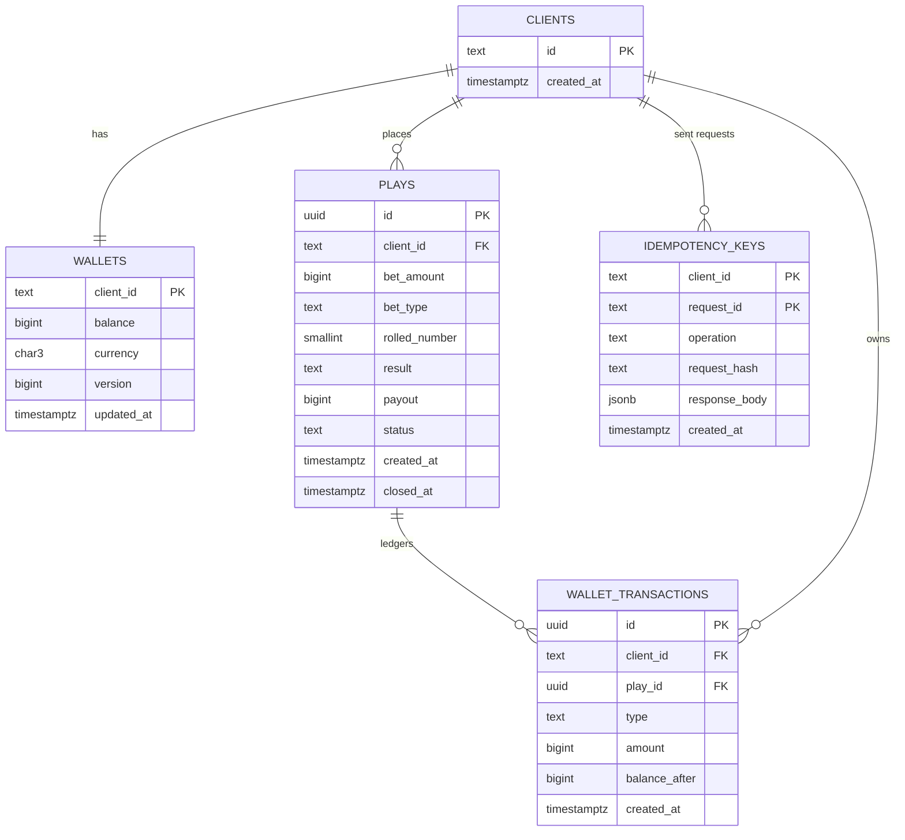

# Dice Bet

A production-quality Go backend for a dice game where a player bets whether the next roll is `EVEN` or `ODD`. Built for a technical assessment; graded on architecture, concurrency correctness, error handling, and tests rather than feature count.

## Overview

- A die (1–6) is rolled server-side using `crypto/rand` behind an injectable `DiceRoller` interface.
- **Win**: the player receives 2x the bet (stake back + equal profit). **Lose**: the bet is forfeited.
- Three operations, exposed over both **WebSocket** (primary contract) and **REST** (for Postman):
  - **Wallet**: `clientId` → current balance.
  - **Play**: `clientId, betAmount, betType` → rolls the die, debits the bet immediately, stores an `OPEN` play with its outcome already computed, returns the roll/result/pending payout.
  - **EndPlay**: `clientId` → credits the pending payout (0 on a loss), closes the play, returns the credited amount and new balance.
- Money is always `int64` minor units (cents) in Go and `BIGINT` in Postgres — never floats.
- Every mutating request carries a client-generated `requestId` (WebSocket) / `Idempotency-Key` header (HTTP): replaying the same one returns the original response instead of re-executing.
- Concurrency safety (same client, multiple simultaneous requests, even across multiple server instances) is enforced with `SELECT ... FOR UPDATE` row locks inside a single DB transaction per operation, backed by database constraints as the last line of defense.

## Architecture

Clean Architecture: dependencies point inward only (`transport → service → domain`). The domain package imports nothing from any other layer. Services depend on `port` interfaces; concrete Postgres/gorilla types are wired only in `cmd/server/main.go`.



### Entity-relationship diagram



Key invariants, enforced by the schema itself (last line of defense, mirrored by service-layer checks first):
- `uq_plays_one_open_per_client`: a **partial unique index** on `plays(client_id) WHERE status = 'OPEN'` — at most one OPEN play per client, database-guaranteed.
- `CHECK (balance >= 0)` on `wallets` — a debit can never take a balance negative.
- `UNIQUE (play_id, type)` on `wallet_transactions` — a play can never be debited or credited twice.
- `PRIMARY KEY (client_id, request_id)` on `idempotency_keys` — a repeated `requestId` can only be inserted once; the loser of a race is safely retried (see "Idempotency race" under [Assumptions and trade-offs](#assumptions-and-trade-offs)).

Two additions beyond the given schema, both justified here:
- A plain (non-unique) `idx_plays_client_id` index on `plays(client_id)`, alongside the partial unique index — the partial index only covers `WHERE status = 'OPEN'` rows, so a client's historical `CLOSED` plays would otherwise require a full table scan to look up.
- A `request_hash` column on `idempotency_keys` (migration `000003`), fingerprinting the request's actual parameters. Without it, replaying a `requestId` with *different* parameters than the original request (e.g. a retried `play.start` with a corrected `betAmount`) would silently return the stale first response instead of being rejected. A mismatch now returns `VALIDATION_ERROR`.

### Folder layout

```
cmd/
  server/        composition root: config, pool, migrations, wiring, graceful shutdown
  migrate/       standalone CLI for `make migrate-up` / `make migrate-down`
internal/
  config/        env-var configuration with defaults + validation
  domain/        entities, dice rules, typed errors — zero external imports
  port/          interfaces the service layer depends on (repos, TxManager, DiceRoller)
  service/       Wallet/Play/EndPlay use cases, orchestrating ports inside one transaction
  repository/postgres/  pgx/v5 implementations of the port interfaces, plain SQL
  infrastructure/random/ crypto/rand DiceRoller implementation
  transport/ws/   WebSocket upgrade, connection lifecycle, message router, controller
  transport/http/ REST mirror for Postman, same services/DTOs
  dto/            wire-format request/response shapes + structural validation
migrations/       embedded SQL migrations (golang-migrate)
test/e2e/         full-stack tests against a real Postgres (testcontainers): happy path + concurrency proofs
postman/          Postman collection
```

### SOLID in this codebase

- **S**: `WalletService`/`GameService` each own one use-case group; `Controller`s only translate DTO ⇄ service calls; repositories only persist; `mapError` only maps errors.
- **O**: a new WebSocket message type is added by registering a handler on the `Router` — no existing handler changes.
- **L**: the Postgres repositories and the in-memory test fakes both satisfy the same `port` interfaces and are interchangeable in `GameService`.
- **I**: `WalletRepository`, `PlayRepository`, `TransactionRepository`, `IdempotencyRepository` are separate small interfaces; `DiceRoller` has exactly one method.
- **D**: `WalletService`/`GameService` depend on `port` interfaces, never on `pgx` or `gorilla` types directly; only `cmd/server/main.go` constructs concrete implementations.

## Domain state machine (Play)

```
        Play (new)
            │
            ▼
        ┌───────┐   EndPlay    ┌────────┐
        │ OPEN  │─────────────▶│ CLOSED │
        └───────┘              └────────┘
            ▲
            │ rejected while OPEN exists: PLAY_ALREADY_IN_PROGRESS
```

- A client has at most 0 or 1 `OPEN` play at any time (DB-enforced).
- `Play` creates a play directly in `OPEN` — the roll, result and payout are already computed; the payout is *pending* until `EndPlay`.
- `EndPlay` transitions `OPEN → CLOSED`, crediting the pending payout exactly once. `CLOSED` is terminal; there is no other transition.

## WebSocket contract

Endpoint: `ws://localhost:8080/ws`. JSON text frames.

**Request envelope**
```json
{ "type": "wallet.get | play.start | play.end", "requestId": "uuid-v4", "payload": { } }
```

**Success response**
```json
{ "type": "wallet.get.result | play.start.result | play.end.result", "requestId": "same uuid as request", "success": true, "data": { }, "timestamp": "RFC3339" }
```

**Error response**
```json
{ "type": "error", "requestId": "uuid or null if the request could not be parsed", "success": false, "error": { "code": "INSUFFICIENT_BALANCE", "message": "human readable message", "details": { "field": "betAmount" } }, "timestamp": "RFC3339" }
```

### Payloads

| Type | Request payload | Response data |
|---|---|---|
| `wallet.get` | `{ "clientId" }` | `{ "clientId", "balance", "currency" }` |
| `play.start` | `{ "clientId", "betAmount", "betType" }` | `{ "playId", "clientId", "betAmount", "betType", "rolledNumber", "result", "payout", "status", "balance" }` |
| `play.end` | `{ "clientId" }` | `{ "playId", "clientId", "result", "creditedAmount", "status", "balance" }` |

### Error codes (single source of truth: `internal/domain/errors.go`)

| Code | WS | HTTP |
|---|---|---|
| `INVALID_MESSAGE` (malformed JSON / missing envelope fields) | error frame | 400 |
| `UNKNOWN_MESSAGE_TYPE` | error frame | 404 |
| `VALIDATION_ERROR` (missing/invalid payload fields) | error frame | 400 |
| `INVALID_BET_AMOUNT` | error frame | 422 |
| `INVALID_BET_TYPE` | error frame | 422 |
| `CLIENT_NOT_FOUND` | error frame | 404 |
| `INSUFFICIENT_BALANCE` | error frame | 422 |
| `PLAY_ALREADY_IN_PROGRESS` | error frame | 409 |
| `NO_ACTIVE_PLAY` | error frame | 409 |
| `SERVICE_UNAVAILABLE` | error frame | 503 |
| `INTERNAL_ERROR` (never leaks SQL/internal detail) | error frame | 500 |

## HTTP mirror (for Postman)

Same use cases, same services/DTOs — this also demonstrates the business layer is transport-agnostic.

- `GET  /api/v1/clients/{clientId}/wallet`
- `POST /api/v1/plays` — body `{ "clientId", "betAmount", "betType" }`, header `Idempotency-Key` (required)
- `POST /api/v1/plays/end` — body `{ "clientId" }`, header `Idempotency-Key` (required)
- `GET  /health` — checks database connectivity via `pool.Ping`

## How to run

### With Docker (recommended)

```sh
docker compose up --build
```

This starts Postgres, applies migrations, seeds a few clients, and starts the app on `:8080`. Postgres is also published on host port `5433` (not `5432`, to avoid clashing with a locally installed Postgres) if you want to connect with `psql` directly.

Seeded clients (see `migrations/000002_seed_clients.up.sql`): `alice` (1,000.00 EUR), `bob` (500.00 EUR), `carol` (250.00 EUR), `dave` (0.00 EUR — handy for exercising `INSUFFICIENT_BALANCE`).

### Locally against a Postgres you already have

```sh
cp .env.example .env   # adjust DATABASE_URL etc.
make run                # loads .env, applies migrations (RUN_MIGRATIONS=true by default), starts the server
```

## How to test

```sh
make test-unit         # go test -short -race ./...        — no Docker required
make test-integration   # go test -race ./internal/repository/postgres/... ./test/e2e/...  — requires a local Docker daemon (testcontainers)
make test               # everything, with -race
make cover               # coverage.html
```

- **Domain** (`internal/domain`): `IsWin` for all 6 faces × both bet types, payout math, `Wallet.Debit`/`Credit` invariants including int64 overflow — 100% coverage.
- **Service** (`internal/service`, in-memory fakes + a fake `TxManager` that snapshots/restores state to simulate real rollback): every protection rule, win/loss happy paths, `EndPlay` credits 0 on a loss, calling `EndPlay` twice never double-credits, idempotent replay returns the identical response with zero side effects, the idempotency-conflict retry path, repository failures propagating as `INTERNAL_ERROR`, rollback on a mid-transaction failure — 86% coverage.
- **Repository integration** (`internal/repository/postgres`, testcontainers): CRUD, `FOR UPDATE` row-lock blocking behavior (proven by racing two transactions), the partial unique index rejecting a second OPEN play, the balance check constraint, ledger uniqueness, Postgres error → domain error mapping.
- **Concurrency** (`test/e2e`, real Postgres, `-race`): 20 goroutines firing `Play` for the same client — exactly one succeeds, the other 19 get `PLAY_ALREADY_IN_PROGRESS`, and the balance/ledger reflect exactly one debit. Same pattern for `EndPlay` (credited exactly once).
- **Transport**: WebSocket integration tests via `httptest.Server` + a real `gorilla/websocket` client (full flow, malformed JSON, unknown type, oversized message, connection stays open after a recoverable error, graceful `Shutdown`). HTTP handler tests via `httptest.ResponseRecorder` covering every status code mapping.

### Testing the WebSocket endpoint manually

**In Postman**: `New → WebSocket Request`, URL `ws://localhost:8080/ws`, then send these as the message body (Postman's WebSocket tab lets you paste raw text):

```json
{"type":"wallet.get","requestId":"11111111-1111-4111-8111-111111111111","payload":{"clientId":"alice"}}
```
```json
{"type":"play.start","requestId":"22222222-2222-4222-8222-222222222222","payload":{"clientId":"alice","betAmount":500,"betType":"EVEN"}}
```
```json
{"type":"play.end","requestId":"33333333-3333-4333-8333-333333333333","payload":{"clientId":"alice"}}
```

**With `websocat`** (`brew install websocat`, optional convenience — not required for anything in this repo):

```sh
websocat ws://localhost:8080/ws
{"type":"wallet.get","requestId":"11111111-1111-4111-8111-111111111111","payload":{"clientId":"alice"}}
```

### Postman collection

`postman/dice-game.postman_collection.json` — import it, set the `baseUrl` and `clientId` collection variables (defaults: `http://localhost:8080`, `alice`), run the **Happy Path** folder (Wallet → Play → EndPlay → Wallet, with assertions on status/schema/balance math) and the **Protections** folder (bet above balance, zero/negative bet, invalid bet type, play while one is open, end play with none open, unknown client, replayed idempotency key). A pre-request script generates a fresh UUID `Idempotency-Key` for every request.

## Assumptions and trade-offs

- **Pessimistic locking vs. the `version` column**: `SELECT ... FOR UPDATE` inside a single transaction is the *sole* concurrency-control mechanism, and it is what makes this safe across multiple stateless server instances — the lock is held by Postgres, not application memory. The `version` column on `wallets` is incremented on every mutation as a belt-and-suspenders audit/optimistic-check guard (the `UPDATE` also matches on the pre-increment version), not the primary mechanism: every mutation path already goes through the row lock, so that extra match should always succeed; it exists as insurance against a hypothetical future code path that mutates the wallet outside a locked transaction.
- **Idempotency race**: two requests with the identical `(clientId, requestId)` racing concurrently are still safe even before either commits, because the wallet row lock already serializes them. The residual race is the `idempotency_keys` insert itself — on a unique-violation the whole transaction (including its business mutation) is rolled back and retried (bounded, 3 attempts with a short backoff), so the retry observes and returns the winner's committed response instead of erroring.
- **`requestId` uniqueness scope**: a `requestId` is expected to be globally unique per client across operation types, matching the given `(client_id, request_id)` primary key. Reusing one across a different operation, or replaying it with different request parameters (e.g. a different `betAmount`), is rejected with `VALIDATION_ERROR` rather than silently replaying a mismatched response — the latter is enforced via a SHA-256 fingerprint of the request parameters stored alongside the cached response (`request_hash`, migration `000003`).
- **Idempotency caching only on success**: the idempotency record is written only after all validation and business checks pass, in the same transaction as the mutation. A rejected request (e.g. `INSUFFICIENT_BALANCE`) is never cached, so retrying the same `requestId` after fixing the input correctly re-executes.
- **Idempotency key retention**: rows in `idempotency_keys` accumulate indefinitely in this implementation. A production deployment needs a scheduled purge (e.g. delete rows older than 72h) — see Production considerations.
- **Module layout**: the Go module lives at the repo root (`github.com/drzbraz/dice-bet`) rather than nesting a `dice-game/` subfolder, since there is exactly one module here and an extra path segment only lengthens imports.
- **WebSocket library**: `gorilla/websocket`. It's the most widely deployed, best-documented option, integrates directly with `net/http`'s `Hijacker` for the upgrade, and its single documented constraint — at most one goroutine may write to a connection at a time — is a deliberate fit here: each connection has exactly one writer goroutine, fed by a buffered channel carrying application messages, pings, and the close frame.
- **Validation**: DTO-level structural validation (required fields) is hand-written (`internal/dto/*.go`), not a third-party validator library, to keep the dependency surface minimal — consistent with "stdlib-first."
- **Auth-less transports**: neither transport authenticates the caller; a client self-asserts `clientId` in the payload. This is an explicit, intentional assessment-scope simplification — see Production considerations.
- **Migrations vs. the connection pool**: `golang-migrate` operates on `database/sql`, while the app's runtime pool is a native `pgxpool.Pool`. `RunMigrations` opens a short-lived `*sql.DB` via `pgx/v5/stdlib` purely for the migration step, then closes it before the long-lived pool is constructed.

## What would change for production

- **Auth**: bind the authenticated session/connection to exactly one `clientId` (e.g. a JWT validated at the WebSocket handshake or in HTTP middleware) instead of trusting a client-supplied field.
- **Rate limiting**: per-client and per-connection limits on both transports.
- **Idempotency key cleanup job**: a scheduled task purging `idempotency_keys` rows past a retention window.
- **Read replicas**: `GetBalance` (a pure read) could be served from a replica; `Play`/`EndPlay` still need the primary for the row lock.
- **Observability**: request tracing (OpenTelemetry), metrics (win rate, error rate by code, p99 latency), structured log correlation IDs threaded through `requestId`.

## Configuration

All via environment variables (see `.env.example` for defaults): `PORT`, `DATABASE_URL`, `DB_MAX_CONNS`, `MIN_BET`, `MAX_BET`, `RUN_MIGRATIONS`, `READ_TIMEOUT`, `WRITE_TIMEOUT`, `WS_PING_INTERVAL`, `WS_MAX_MESSAGE_BYTES`.
